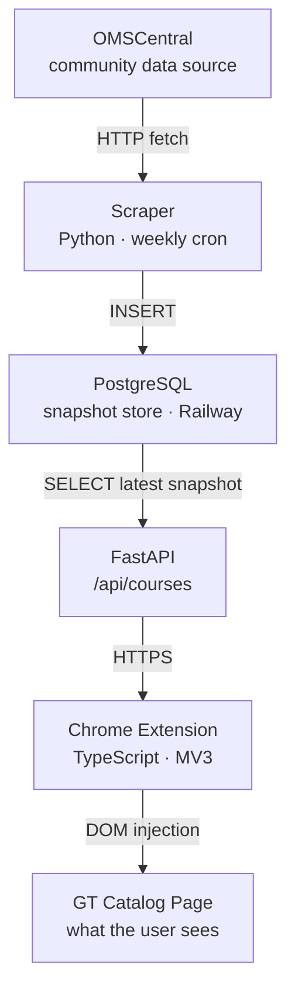

# omscs-radar

A Chrome extension that overlays community ratings, difficulty, and workload directly on the [Georgia Tech OMSCS course catalog](https://omscs.gatech.edu/current-courses), pulling data from [OMSCentral](https://www.omscentral.com).

> **Status:** Work in progress. Built by an incoming OMSCS student to plan their courses better and to give back something useful to the community.

## Why this exists

The official OMSCS catalog lists ~60 courses but tells you nothing about what they are actually like. The community has built excellent review sites, but using them means leaving the catalog, searching each course, and context-switching constantly. omscs-radar surfaces aggregate ratings right next to each course on the official catalog, so you can scan the list and decide what to dig into.

## Live URLs

- **API docs (interactive):** https://backend-production-3c97.up.railway.app/docs
- **Health check:** https://backend-production-3c97.up.railway.app/healthz
- **Course data:** https://backend-production-3c97.up.railway.app/api/courses

## Architecture

### Data Flow


## Repository layout

```
omscs-radar/
├── scraper/              Python 3.11+ scrapers (httpx, BeautifulSoup, Pydantic, structlog)
│   ├── src/scraper/
│   ├── scripts/          one-off and exploratory scripts
│   └── pyproject.toml
├── backend/              FastAPI + SQLAlchemy 2.0 + Alembic
├── extension/            Chrome MV3 extension (TypeScript)
└── .github/workflows/    CI + weekly scraping cron
```

## Roadmap

- [x] **Phase 1** — Python scraper (OMSCentral via Next.js RSC payload, typed Pydantic models, CLI with structured logging)
- [x] **Phase 2** — Postgres schema, SQLAlchemy 2.0 models, Alembic migrations, scraper persists snapshots
- [x] **Phase 3** — FastAPI backend serving `/api/courses`, deployed to Railway
- [x] **Phase 4** — Chrome extension (Manifest V3, TypeScript)
- [x] **Phase 5** — GitHub Actions weekly cron
- [ ] **Phase 6** — Chrome Web Store submission

## Data sources

This project depends on volunteer-run community sites. We aim to be good citizens of that community:

- We honor `robots.txt`
- We identify ourselves via a descriptive `User-Agent` with a contact link to this repo
- We rate-limit aggressively and run scrapes at most once per week
- We attribute sources prominently in the extension UI
- We plan to reach out to the maintainers of both projects to coordinate on data access; direct access (if offered) is preferred over scraping

### A note on OMSCentral

OMSCentral is a Next.js application. Rather than parsing the rendered DOM, the scraper extracts data directly from the React Server Components (RSC) streaming payload embedded in the page. This is more robust than HTML scraping and gives access to fields the visible table does not show, including descriptions, foundational/deprecated flags, credit hours, and more.

### A note on OMSHub

OMSHub is hosted on Vercel and protected by Vercel's bot-detection layer, which serves a JavaScript challenge to non-browser HTTP clients. Simple HTTP requests receive a `429` response. Until we coordinate directly with the OMSHub maintainers or implement a headless browser approach, the project ships with OMSCentral data only.

---

If you maintain OMSHub or OMSCentral and would prefer a different arrangement, please open an issue.
